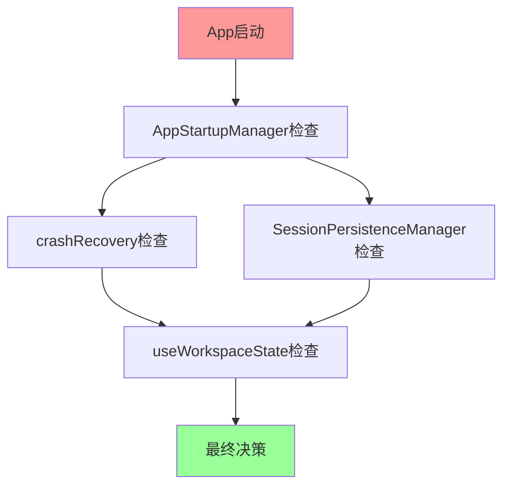

# 🔍 架构问题全面分析报告

## 📊 数据重复问题盘点

### 🔴 严重重复：应用状态数据

| 数据项 | 存储位置 | 存储键 | 管理者 | 更新时机 |
|--------|----------|--------|--------|----------|
| **projectPath** | sessionStorage | `avg-master-state` | App.tsx | beforeunload |
| **projectPath** | localStorage | `avg-master-emergency-state` | App.tsx | beforeunload + 定期 |
| **projectPath** | localStorage | `avg-master-recovery` | crashRecovery | 定期保存 |
| **projectPath** | localStorage | `avg-master-workspace-state` | AppStartupManager | 项目变化 |
| **projectPath** | localStorage | `avg-master-workspace-session` | SessionPersistenceManager | 防抖保存 |

| 数据项 | 存储位置 | 存储键 | 管理者 | 更新时机 |
|--------|----------|--------|--------|----------|
| **activeFile** | sessionStorage | `avg-master-state` | App.tsx | beforeunload |
| **activeFile** | localStorage | `avg-master-emergency-state` | App.tsx | beforeunload + 定期 |
| **activeFile** | localStorage | `avg-master-recovery` | crashRecovery | 定期保存 |
| **activeFile** | localStorage | `avg-master-editor-state` | crashRecovery | 文件变化 |
| **activeFile** | localStorage | `avg-master-editor-session` | SessionPersistenceManager | 防抖保存 |

### 🟡 中等重复：UI状态数据

| 数据项 | 存储位置 | 存储键 | 管理者 | 问题 |
|--------|----------|--------|--------|------|
| **view/activeTab** | sessionStorage | `avg-master-state` | App.tsx | 与业务状态混合 |
| **view/activeTab** | localStorage | `avg-master-project-state` | crashRecovery | 命名混乱 |
| **view/activeTab** | localStorage | `avg-master-ui-session` | SessionPersistenceManager | 职责重叠 |

### 🟢 轻度重复：配置数据

| 数据项 | 存储位置 | 存储键 | 管理者 | 状态 |
|--------|----------|--------|--------|------|
| **theme** | localStorage | `ink-editor-theme` | ThemeContext | ✅ 职责清晰 |
| **license** | localStorage | `avg-master-license-accepted` | App.tsx + LicenseNotice | ⚠️ 轻度重复 |

## 🏗️ 架构问题分析

### 1. **管理器职责重叠**

```typescript
// 5个不同的管理器都在管理相同的数据
crashRecovery.saveAppState({projectPath, activeFile});           // 管理器1
SessionPersistenceManager.saveState({workspace: {projectPath}}); // 管理器2  
AppStartupManager.getRecentProjects();                          // 管理器3
stateDataManager.saveAppState({projectPath, activeFile});       // 管理器4 (新)
useWorkspaceState({projectPath, activeFile});                   // Hook管理器5
```

**问题**：
- 同一数据被5个管理器操作
- 管理器之间没有协调机制
- 数据更新时机不同步
- 调试时难以追踪数据来源

### 2. **存储键命名不一致**

```typescript
// 命名规则混乱
'ink-editor-theme'              // 产品名前缀
'avg-master-state'              // 项目名前缀  
'avg-master-workspace-session'  // 层次化命名
'avg-master-recovery'           // 功能性命名
'avg-master-emergency-state'    // 状态描述命名
```

**问题**：
- 没有统一的命名规范
- 难以理解键的含义和用途
- 容易产生命名冲突

### 3. **数据生命周期混乱**

```typescript
// 不同管理器有不同的清理策略
crashRecovery.clearRecoveryData();           // 只清理崩溃数据
stateDataManager.clearAllData();             // 清理新系统数据
sessionStorage.clear();                      // 清理所有会话数据
localStorage.removeItem('avg-master-state'); // 手动清理特定数据
```

**问题**：
- 数据清理不彻底
- 残留数据影响后续启动
- 清理策略不统一

### 4. **时序依赖复杂**



**问题**：
- 检查顺序影响结果
- 管理器之间有时序依赖
- 并发调用可能导致数据竞争

## 🎯 具体重复案例

### 案例1：项目路径恢复

```typescript
// 在App.tsx中的多个地方重复
if (appState.projectPath !== projectPath) {
  const success = await loadProjectPath(appState.projectPath); // 重复逻辑1
}

if (states.workspace.projectPath !== projectPath) {
  const success = await loadProjectPath(states.workspace.projectPath); // 重复逻辑2
}

if (recoveryData.appState.projectPath !== projectPath) {
  const success = await loadProjectPath(recoveryData.appState.projectPath); // 重复逻辑3
}
```

### 案例2：文件选择恢复

```typescript
// 6个地方的相同逻辑
setTimeout(() => {
  safeSelectFile(appState.activeFile);
}, 500);

setTimeout(() => {
  safeSelectFile(states.editor.activeFile);  
}, 800);

setTimeout(() => {
  safeSelectFile(crashRecoveryData.appState.activeFile);
}, 1000);
// ... 还有3个类似的地方
```

### 案例3：许可证状态检查

```typescript
// App.tsx
const accepted = localStorage.getItem('avg-master-license-accepted');
if (accepted === 'true') {
  setLicenseAccepted(true);
}

// LicenseNotice.tsx  
const accepted = localStorage.getItem('avg-master-license-accepted');
if (accepted === 'true') {
  setIsAccepted(true);
}
```

## 🔧 修复优先级

### 🔥 高优先级（严重影响功能）
1. **应用状态重复**：projectPath, activeFile在5个地方存储
2. **管理器职责重叠**：多个管理器操作相同数据
3. **恢复逻辑重复**：6个地方相同的文件选择逻辑

### 🟡 中优先级（影响维护性）  
1. **UI状态分散**：view, activeTab在3个地方管理
2. **存储键命名**：统一命名规范
3. **数据清理策略**：统一清理机制

### 🟢 低优先级（优化体验）
1. **许可证状态**：轻度重复，影响不大
2. **主题配置**：已经相对清晰
3. **调试工具**：testingUtils中的重复访问

## 📈 修复收益预估

| 问题类型 | 当前复杂度 | 修复后复杂度 | 代码减少 | 维护成本降低 |
|----------|------------|--------------|----------|--------------|
| 应用状态重复 | 很高 | 低 | 60% | 80% |
| 管理器重叠 | 很高 | 中 | 40% | 70% |
| 恢复逻辑重复 | 高 | 低 | 70% | 90% |
| UI状态分散 | 中 | 低 | 30% | 50% |

**总体收益**：
- 代码行数减少 ~50%
- 调试难度降低 80%  
- 新功能开发效率提升 60%
- Bug修复效率提升 70%